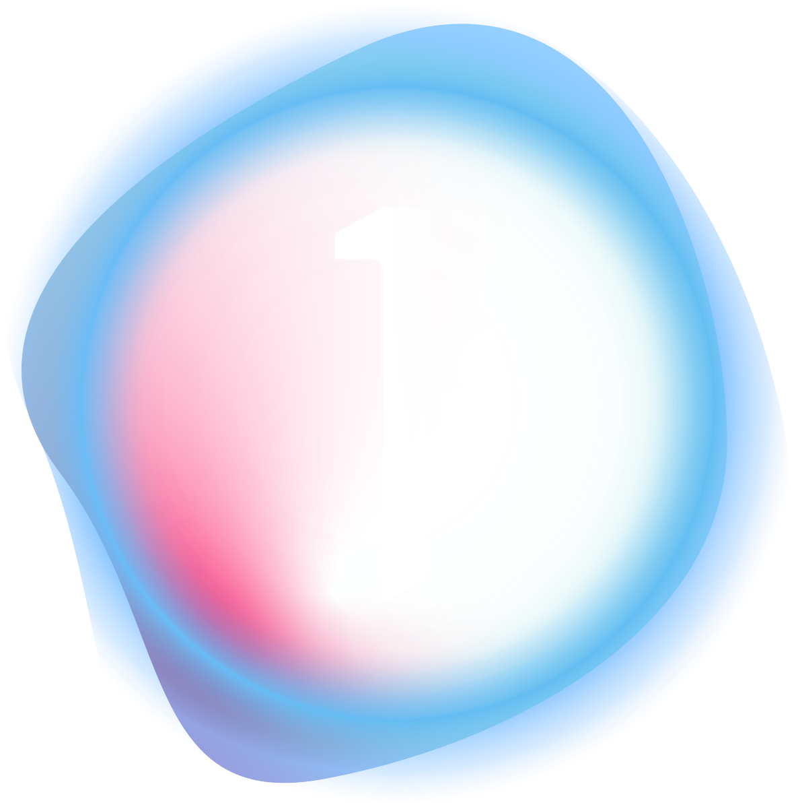
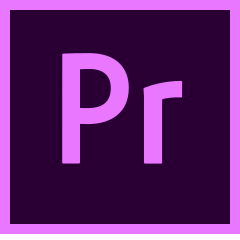

<h1 align="center"> Benjamin Neustadt </h1>

<div align="center">

[](mailto:b.james.neustadt@gmail.com) [](https://benjaminneustadt.github.io/resume/)  [](https://benjamin-neustadt.herokuapp.com/)
</div>

 <div align="center">
    <a href="#profile">Profile</a> |
    <a href="#projects">Projects</a> |
    <a href="#skills">Skills</a> |
    <a href="#edu">Education</a> |
    <a href="#work">Work Experience</a> |
    <a href="#languages">Languages</a> |
    <a href="#hobbies">Hobbies</a> 
 </div>
<br>

<a name="profile"></a>

**Software Engineer** <p align="justify">Previously I worked in the Visual Arts, though I also worked in Education at various stages, and in various capacities. I learn quickly and with lasting impact. I like to approach learning with fun, and be creative when there is space to be so. I made the shift to software development as I felt it aligned with my penchant for problem solving and constant learning. I am reliable, amicable and can pick up new concepts quickly with great drive and enthusiasm.</p>


----


<a name="languages"></a>
### Languages
<div align="center">
 <p><b>English</b> (native); <b>French</b> (native); <b>German</b> (conversational); <b>Thai</b> (conversational); <b>Mandarin</b> (beginner)<p>
 </div>

---

### Tools

<div align="center">
    &nbsp;&nbsp;&nbsp;
    &nbsp;&nbsp;
    &nbsp;&nbsp;
    &nbsp;&nbsp;
    &nbsp;&nbsp;
    &nbsp;&nbsp;
    &nbsp;&nbsp;
    &nbsp;&nbsp;
    &nbsp;&nbsp;
    &nbsp;&nbsp;
    &nbsp;&nbsp;
    &nbsp;&nbsp;
    &nbsp;&nbsp;
    &nbsp;&nbsp;
    &nbsp;&nbsp;
 </div>

----


<a name="proj"></a>
## Projects

| Name                         | Description       | Tech/tools        |
| ---------------------------- | ----------------- | ----------------- |
| [**OpenBook**](https://github.com/BenjaminNeustadt/OPEN-BOOK_new)| **Makers**  _Group Project_ (week 12) - Full stack. App for searching independent book stores with map interactivity. | Node.js, Jest, MongoDB, Mongoose, Cypress, HTML, Jade, CSS |
| [**Acebook**](https://github.com/sophiegilder/acebook-node) | **Makers**  _Group Project_ (week 8-9) - Full stack clone of FaceBook. | Node.js, React, MongoDB, Mongoose, Express, hbs, JSX, Cypress, Jest|
| [**MakersBNB**](https://github.com/BenjaminNeustadt/MakersBNB) | **Makers**  _Group Project_ (week 5) - Full stack clone of Airbnb. | Ruby, RSpec, Capybara, Sinatra, PostgreSQL, HTML, CSS|
| [**Bank Tech Test**](https://github.com/BenjaminNeustadt/Code-Quality-Ruby) | **Makers**  _Solo Project_ (week 10) - Focus on Code Quality, and single responsibility priniciple and TDD. | Ruby, RSpec|
| [**Chitter**](https://github.com/BenjaminNeustadt/chitter-challenge) | **Makers**  _Solo Project_ (week 4) - Full stack clone of Twitter. | Ruby, RSpec, Capybara, Sinatra, PostgreSQL, HTML, CSS|
| [**Task Track**](https://github.com/BenjaminNeustadt/React-desktop-app-) | _Solo Project_ - Simple desktop app, using web technologies. | React, NW.js, HTML, CSS|
| [**OldPhone**](https://github.com/BenjaminNeustadt/OldPhone) | _Solo Project_ - Coding Challenge completed following best practices learnt at Makers, also completed in [C#](https://github.com/BenjaminNeustadt/OldPhone_csharp). | Ruby, Rspec|


----

<a name="edu"></a>
## Education :school:

#### Makers Academy (April 2022 to August 2022)


- I pair-programmed extensively, maintaining composure and calm to maximise problem-solving as a duo.
- OOP: I learnt the foundations of object oriented programming in two dynamically typed scripting languages:[Ruby](https://www.ruby-lang.org/en/about/) and [JavaScript](https://www.javascript.com/learn).
- TDD: All coding was done following test driven development (or BDD), with testing frameworks such as [RSpec](https://relishapp.com/rspec) to ensure a robust codebase.
- Code Reviews: I completed numerous code reviews and group projects, assessing pull requests, and learning from observations made on my own code submissions.
- Team work: Most importantly I cemented the value of working effectively as part of a tech team, using Kanban software such as Github Projects, Trello, along with Agile methodologies in synchronous and asynchronous communication set-ups (principally through Slack).

---
#### Kings College London (October 2016 to May 2019)

**MA Philosophy**
_Grade: high 2:1_

Modules included:
- Film & Philosophy
- Metaphysics
- Philosophy of Mathematics
- First Order Logic (for which I scored the highest of my class)
- Thesis topic: 'Computers as Objects to Think Through'
- Societies: KCL Chess Society

---
#### Univeristy of London, Goldsmiths College (Oct 2011 to May 2014)

 **BA English & American Literature**
 _Grade: high 2:1_

Modules included:
- Prosody
- Linguistics
- Semantics
- American Literature
- Dissertation topic: 'Rhetoric and Syntaxical Linguistics in Edgar Allan Poe'

----
<a name="work"></a>
## Work Experience :office:

**CESP, Wachirawit School, Chiang Mai, Thailand** (Dec 2020 to Aug 2021)

_Academic Consultant_

```
- Responsible for building the team of a new international department; curriculum mapping; liasing with heads of departments.
- Involved in negotiating partnerships with regional and international academic authorities:
including Cambridge International - in sight of Cambridge International Accreditation;
and Chiang-Mai University - in sight of a program sponsoring one of the United Nations SDG initiatives.
- Identified CRM solutions using key knowledge of the industry.
```

---
**Prince Royal College, Chiang Mai, Thailand** (Sept 2020 - Dec 2020)
_EFL Teacher_

```
- Lecturer for Focused English Program (International section)
on topics such as Continental Philosophy and Film studies.
- Rejuvenated curriculum in collaboration with the Head of Languages.
```

---
**Freelance, Paris** (Sep 2018 - Nov 2019)

_Lighting and Digital Technician_

```
- Photographers included: Jonas Unger, Nadim Asfar, Crista Leonard, Greg Kadel.
- Clients included: Chaumet, Nike, Dior, Vogue FR/UK/US, Harper's Bazaar.
- On location digital technician meant I was responsible for digital image processing. This resulted in the client/creative director being able to comment and adjust the direction of the shoot on the fly.
- On location lighting technician meant I was responsible for lighting the subject correctly in accord with a brief/moodboard.
- Able to hold a calm manner and come up with effective resolves in a very fast paced environment, leading to a robust and supportive framework for the creative process.
```

---
**Studios Daylight, Paris** (Sep 2018 - Nov 2019)

_Assistant to Studio Director_

```
- Integrated competitive photography studio to work with veteran lighting consultant.
- Lighting and numerical equipment preparations for large budget campaigns.
- Hosted Editorial & Commercial shoots.
- Built and maintained lasting client relationships: resulting in several big player clients choosing us as habitual go to.
```

---
**CHRIS-TURNER-STUDIOS** (Sep 2015 - Jul 2018)

_Assistant Photographer_

```
- Specialising in technical still-life photography for advertorial campaigns
- Helped plan moodboards, technical set-ups for technical shoots
- Showed quick resolve and adatability: for instance, switching between PhaseOne digital cameras to more refined gear and methods such as a Sinar with bellows.
- Thorough understanding of technical motion and photographic technologies(e.g. grip, software).
- As onsite digital tech worked extensively with: Capture One, Photoshop, AfterEffects, PhaseOne OS
```

---
<a name="Skills"></a>
## Skills

* ##### Team Player - Healthy communication and rapport building


I have extensive experience in working with teams made up of people from different cultures and backgrounds throughout my various professoinal roles, and in my personal life. I am a strong and considerate communicator, which has served as an asset on numerous occasions when working in large international teams; one example might be when I was involved in negotiating a partnership between a private school and the regional academic authority, Chiang Mai University, in northern Thailand, where I served as lead Academic consultant. The partnership was centered around the 28th point of the United Nations’ SDG initiatives. Given that my employer was Chinese, and our negotiating partners were a mixture of Western and Thai, there were cultural differences that extended to communication styles. My ability to manoeuvre varying modes of communication comfortably served as an asset in navigating what might have otherwise been unproductive meetings. Potential misunderstandings were diffused and the grounds for a robust partnership were agreed upon. I am always on the lookout for conferences/talks that I can learn from to reinforce this even more, the latest I attended was presented by Twilio,[here](https://yougotthis.io/collections/happy-healthy-communication).

* ##### Proactive learner

I engage in all activities I pursue whole-heartedly, and make it a point to learn around the topic at hand in order to get a more thorough and well rounded understanding. I like to learn in depth, and think of what I know in new ways, which is one of the reasons I love Ruby so much. There are so many ways to re-think about a given problem. I actively document my learning process in a book included on my website, [here](https://benjamin-neustadt.herokuapp.com/documentations).

I have learnt to use Vim, and have gotten into the habit of pairing exclusively through tmux ssh sessions whenever possible, as I have an obsession with doing everything through the command-line!
Since finishing Makers, I have continued to build apps specifically on the Sinatra and Rails frameworks - which can be viewed in my [repositories](https://github.com/BenjaminNeustadt?tab=repositories). The most recent example is my website, built using Sinatra, and deployed on Heroku. 

In terms of Kanban, I have continued to explore avenvues for streamlining my work process in order to be more effective in my work; I have recently taken to using [Taskwarrior](https://taskwarrior.org/), an in commmand-line solution to Kanban, as well as [Timewarrior](https://timewarrior.net/).


* ##### Work ethic and discipline

I really thrive on being placed outside my comfort zone in all aspects of life. I enjoy challenges. 
Able to persevere through difficult experiences and learning curbs quickly, whilst maintaining focus. 
My persistent [contributions](https://github.com/BenjaminNeustadt) on my Github show my consistency in applying myself to pushing my skills further and further. More so than that, I think my detailed and meticulous process of organising my processes and understanding in [my book](https://benjamin-neustadt.herokuapp.com/documentations) show this also.


---

#### Other qualifications and training

- OIB (International Baccalaureate) - was one of 3 students (national level) to score 100 percent for English Literature.
- Specilized training in Bolex 16mm film, at the ETNA atelier in Paris.
- Trained in live-stream editing, before becoming part of a live-stream broadcasting team at the Roundhouse, London.
- Professional working proficiency in:
 <div align="center">
  &nbsp;&nbsp;
  &nbsp;&nbsp;
  &nbsp;&nbsp;
  &nbsp;&nbsp;
   &nbsp;&nbsp;
</div>

---
<a name="hobbies"></a>
## Hobbies

- **Learning languages** (currently attempting Mandarin).
- **Photography**  :camera:
- **Reading**: I mainly enjoy reading non-fiction (History, Politics).
- **Travel**: I love to learn about new cultures and place myself in environments where learning the local customs becomes a necessity.
- **Martial Arts**: When living in London I was an active member of Islington Boxing Club. Later on when I lived in Thailand I re-discovered a passion for Martial Arts. I enjoy Muay Thai, and I enjoy ice-baths.🧊
- **Lead climbing**: When working in a [mountain refuge](https://www.sudouest.fr/economie/tourisme/gavarnie-ou-le-cirque-millenaire-de-la-nature-9731993.php) in the Pyreneese as an adoloscent, I was introduced to climbing by my employer. Since then I have climbed throughout the Pyreneese, the Alps, and a little in Asia (Grading 6c).
- **Meditation**: I spend time in monasteries in Thailand when I can, and continue to practice meditation.

